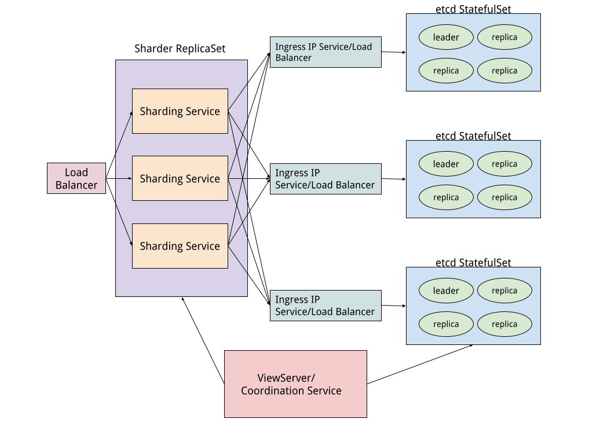
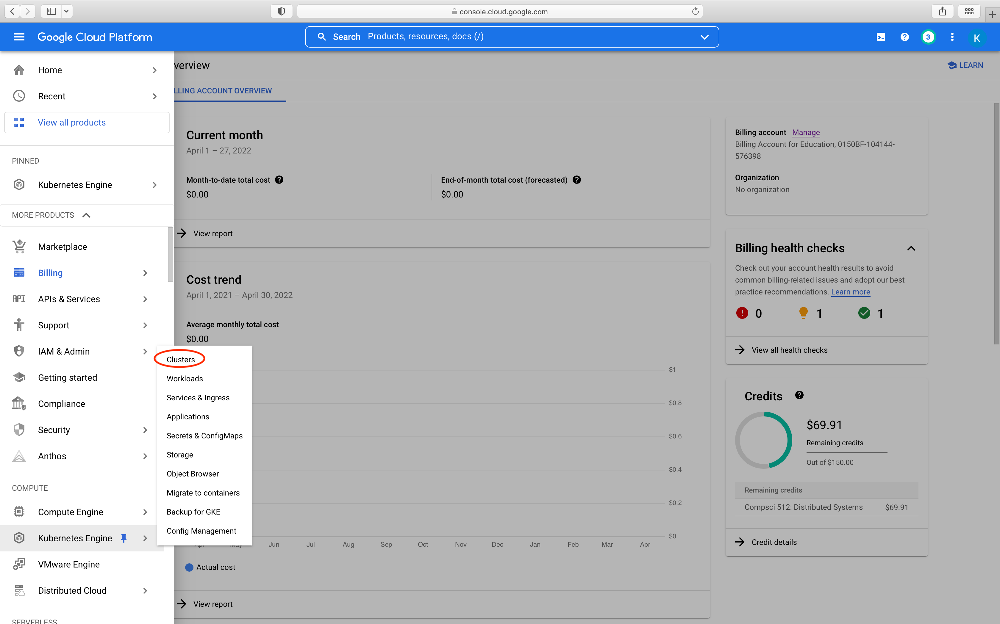
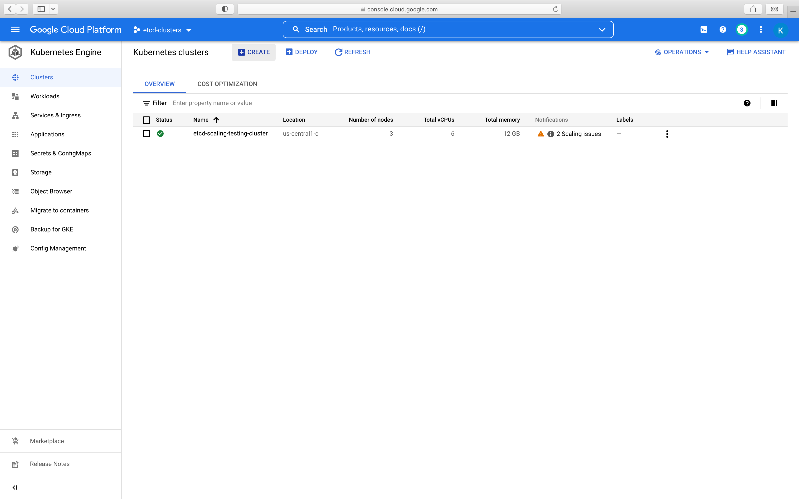
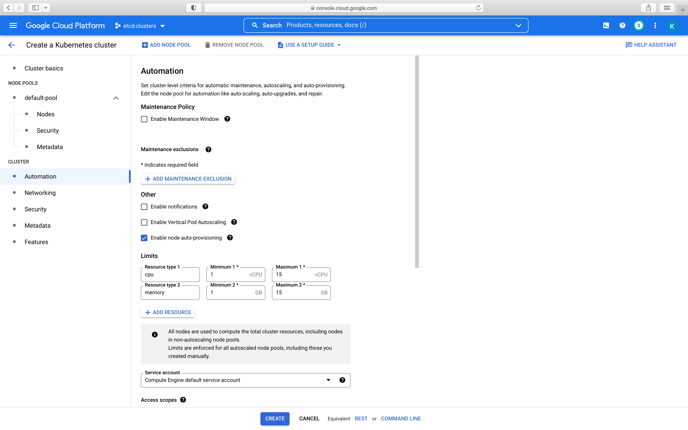
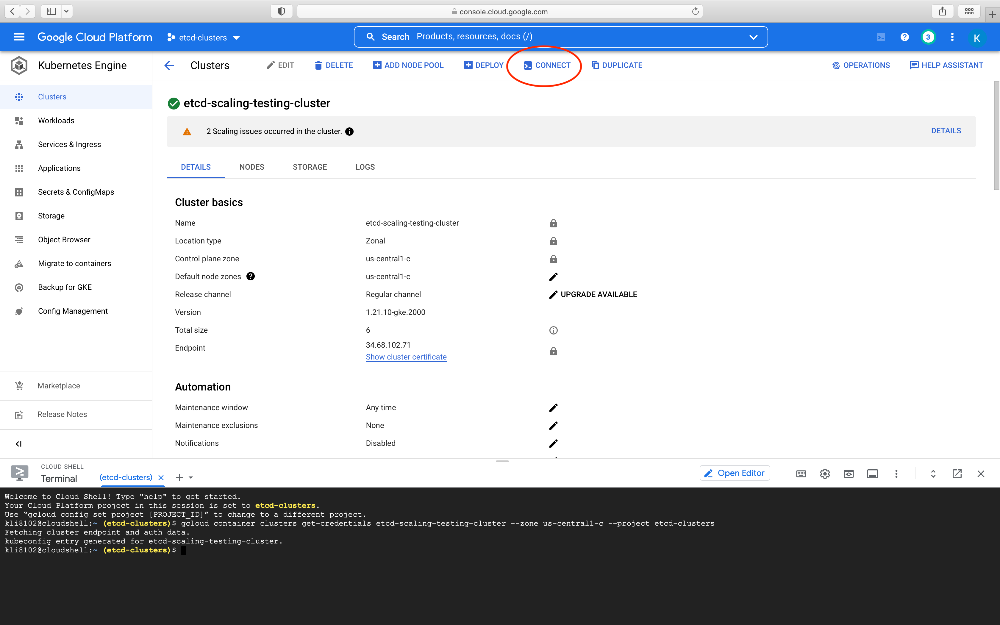
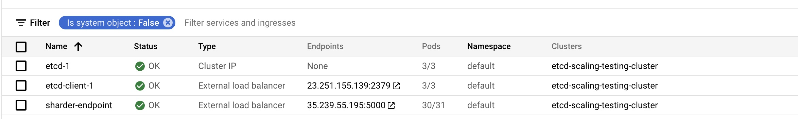

# Vase: A Scalable, Consistent, and Sharded Key-Value Store on Kubernetes
By: Kevin Fang, Kevin Li

Vase is a sharded, consistent and scalable key-value store based on the application etcd, running on Kubernetes. We used ReplicaSet scaling for the sharding service front-end, and StatefulSet scaling for the etcd key-value store backend. The unique nature of etcd allows automatic consensus between leaders and replicas with the Raft algorithm in the Stateful tier, creating a consistent and highly available backend. By scaling both the number of replicas and shards, we were able to demonstrate increased throughput, decreased latency, and improved tail latency.



## Setup

Here we detail how to setup our key-value store on a Kubernetes cluster. First, create a GCP project and open a Cloud Shell. Then follow the instructions below.

## Cluster Creation

First, access the Google Cloud Console and go to the Clusters section in the Kubernetes Engine.



Then create a GKE standard cluster.



Enable node auto-provisioning. This will allow the cluster to auto-provision additional worker nodes to accomodate autoscaling of ReplicaSets and additional StatefulSets.



## Deploying etcd StatefulSets and Sharder ReplicaSets

StatefulSets are workloads with persistent storage that run on cluster nodes. In order to create an etcd StatefulSet, we must first define the storage class that the StatefulSet uses for its persistent volume claims. To provision any resource in a Kubernetes cluster, we must generate a `.yaml` file containing the specifications for that resource.

Our etcd StatefulSets use SSD persistent disks for storage. The storage class `.yaml` specification file for our etcd StatefulSets is located in `deployment_files/storage-class.yaml` with these configurations set. An example etcd StatefulSet `.yaml` file can also be found at `deployment_files/example-etcd-deployment.yaml` and includes deployment configurations for the etcd StatefulSet itself, along with its headless service, and IP service (load balancer) for external access.

ReplicaSets are frontend server applications with no state. Unlike StatefulSets, they require no storage. An example configuration `.yaml` for our sharder ReplicaSet is located in `deployment_files/sharder-deployment.yaml`.

To automatically generate a number of etcd StatefulSets and a sharder ReplicaSet `.yaml` file with a certain number of replicas, we can use he `generate_deployment_files.py` script as follows.

`Usage: ./generate_deployment_files.py <number of deployment .yaml files to generate> <replicas per StatefulSet> <instance number to start> <replicas for ReplicaSet>`

All `.yaml` files generated by the script are placed in the `deployment_files/` directory.

`generate_deployment_files.py` will also automatically generate a deployment script `deploy.sh`.

To deploy the `.yaml` files on the cluster in GCP, connect to the cluster's cloud shell.



If you haven't already, clone this repository in the cloud shell and run `generate_deployment_files.py` with its arguments. Then run `./deployment_files/deploy.sh` from the repository root. It will take the cluster some time to deploy the StatefulSets and ReplicaSet and its other necessary deployments.

## The ViewServer

The ViewServer is still under development has not been deployed on the cluster yet. However, it can be run locally with the command `python3 viewserver.py` and it will still be able to connect to the cluster provided a service account key for the account associated with your cluster is present in the `keys/` folder. Further details on how to create a service account are explained in the Benchmarking section. To deploy the ViewServer to the cluster, you must first create a Dockerfile with the necessary dependencies for the `viewserver.py` file. Then you must build the Dockerfile and push it to either Docker hub or Google Artifact Repository. Then, a `.yaml` file must be generated and it must link to the pushed image. This `.yaml` file can then be deployed to the cluster with `kubectl create -f <name of .yaml file>`. Please see examples in the repository or consult online guides to learn how to create a `.yaml` file.

## Sending Requests to the Cluster

To send GET/PUT requests to the cluster, visit the **Services & Ingress** page of Kubernetes Engine, and note the IP under next to the sharder-endpoint name (not `etcd-client-xyz`). Copy the IP address (including the port number), and add `http://` to the address. Then, you can ping the server with HTTP PUT/GET requests.



Sample requests:

```sh
# put request
curl -X PUT -H "Content-Type: application/json" -d '{"path":"Key 1", "value":"val_1"}' "http://<ip address>:5000/set"
curl -X PUT -H "Content-Type: application/json" -d '{"path":"Key 2", "value":"val_2"}' "http://<ip address>:5000/set"
# get request (replace spaces with %20)
curl https://<ip address>:5000/Key%202 # returns "val_2" with some metadata about sharding

# get request (extracing only the data)
curl "http://<ip address>:5000/get/Key%202" 2>/dev/null | python3 -c "import sys,json; print(json.load(sys.stdin)['data']['node']['value'])" # returns "val_2"
```

### Benchmarking

1. Under the Vase GCP project, create a service account with Owner permissions. Download it as a JSON file and store it in the `keys/` folder.

2. Edit the file `benchmarking/benchmark.py`:

   - Edit line 12 to reflect the name of the service account JSON just downloaded.
   - Edit line 13 (`PROJECT_ID`) with the GCP project ID used to set up the project, line 14 (`ZONE`) with the zone that the Kube project is set up in, and line 15 (`CLUSTER_ID) with the id of the Kube cluster.
   - Edit line 17 to indicate which benchmarks to run. The format should be as follows (note that the numbers should be integers, rather than strings):

     ```python
     TESTS = {
         "<test name 1>": {
             "sharders": <num replicaset sharders>,
             "shards": <num etcd shards>
         },
         "<test name 2>": {
             "sharders": <num replicaset sharders>,
             "shards": <num etcd shards>
         },
         ...
     }
     ```

3. In the `benchmarking/` directory, run `python benchmark.py`. Each benchmark will take ~6-8 minutes to complete.

- Note that the benchmarking program will delete any existing ReplicaSets and StatefulSets and deploy its own from scratch.

4. Results will be saved in a folder with the title of the test.

5. Open `benchmarking/Results Analysis.ipynb` for a template on generating graphs with the resulting information.
